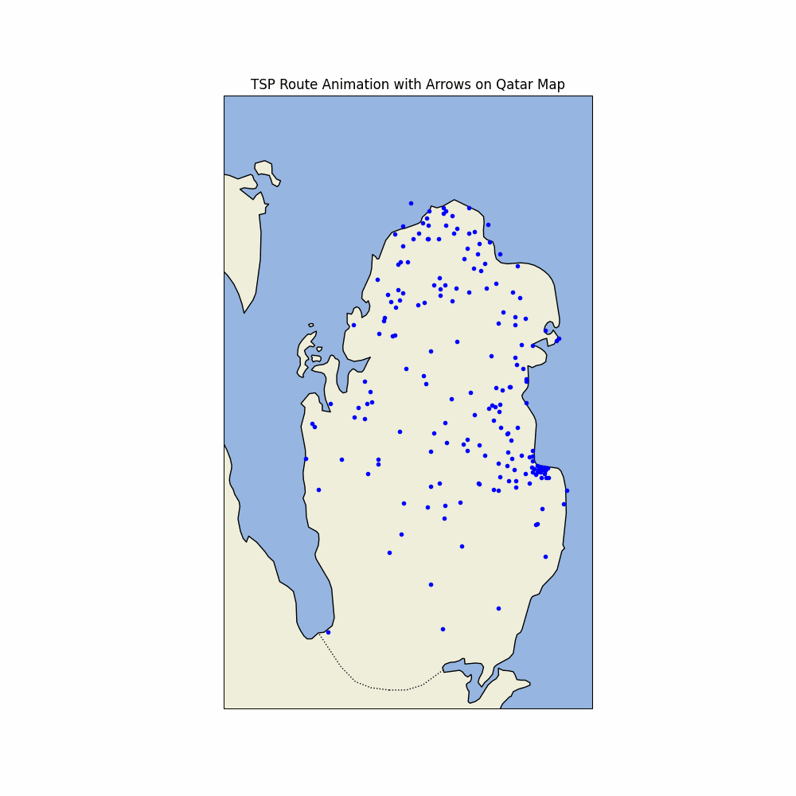

# Self-Organizing Maps and Optimality Gaps for Solving the Traveling Salesman Problem

## Introduction

This project explores the application of **Self-Organizing Maps (SOMs)** to the **Traveling Salesman Problem (TSP)**. SOMs, also known as **Kohonen maps**, are neural networks that reduce high-dimensional data into a low-dimensional representation while preserving the topological properties of the input space.

By adapting SOMs, we aim to generate sub-optimal solutions to the TSP efficiently. The SOM generates an initial route, which is then refined using an **optimality gap-based approach** with the **Gurobi** optimizer to find improved solutions within defined constraints.

---
## Project Motivation

This project was inspired by the work detailed in [this GitHub repository](https://github.com/diego-vicente/som-tsp/tree/master). It provided valuable insights into implementing self-organizing maps for solving the Traveling Salesperson Problem (TSP), forming the basis for the ideas and methodology we have built upon in our project.

---

## Table of Contents

- [Background](#background)
- [Algorithm Modifications](#algorithm-modifications)
- [Implementation](#implementation)
- [Usage](#usage)
- [Evaluation](#evaluation)
- [Results](#results)
- [References](#references)
- [Contributing](#contributing)
- [License](#license)

---

## Background

The **Traveling Salesman Problem** is a classic optimization problem that seeks the shortest possible route visiting a set of cities exactly once and returning to the starting point. Due to its NP-complete nature, finding exact solutions for large instances is computationally intensive.

**Self-Organizing Maps** are unsupervised learning algorithms used for dimensionality reduction and data visualization. They project high-dimensional data onto a lower-dimensional grid while preserving the input data's topological properties.

---

## Algorithm Modifications

To adapt SOMs for the TSP, the following modifications were made:

1. **Circular Neuron Structure**: Instead of a grid, neurons are arranged in a circular ring. Each neuron is connected to its immediate neighbors, forming an elastic ring that adapts to the spatial distribution of cities.

2. **Dynamic Learning Rate and Neighborhood Function**:
   - **Learning Rate (α)**: Starts high to allow significant adjustments and decays over time for fine-tuning.
   - **Neighborhood Radius**: Decreases over time, reducing the influence of the winning neuron on its neighbors.

3. **Neuron Update Rule**:
   - Neurons are updated using the formula:
     ```
     n_{t+1} = n_t + α_t * h(w_e) * Δ(e, n_t)
     ```
     where:
     - `n_t`: Current neuron position
     - `α_t`: Learning rate at time `t`
     - `h(w_e)`: Neighborhood function centered on the winning neuron
     - `Δ(e, n_t)`: Difference between the city position and neuron position

4. **Decay Functions**:
   - Learning rate and neighborhood radius decay over time:
     ```
     α_{t+1} = γ_α * α_t
     h_{t+1} = γ_h * h_t
     ```
     - `γ_α`, `γ_h`: Decay factors for learning rate and neighborhood radius

---

## Implementation

The project is implemented in **Python 3** and is designed to work with TSP instances in the **TSPLIB** format.

### Directory Structure

```
├── Gurobi
│   └── [gurobi.py]
├── assets
│   └── [TSPLIB .tsp files]
├── som-tsp-master
├── output
│   └── optimal_route_output_image
├── README.md
```

### Dependencies

- Python 3.x
- NumPy
- Matplotlib
- Gurobi Optimizer 

---

## Usage

### Installation

1. **Clone the Repository**

   ```bash
   git clone https://github.com/Shlok2002/DBA5103_Project.git
   cd DBA5103_Project
   ```

2. **Install Dependencies**

   *Note: Gurobi requires a separate installation and a valid license.*

### Running the Algorithm

1. **Prepare TSP Data**

   Place your `.tsp` files in the `data` directory.

2. **Execute the Script**

   ```bash
   python gurobi.py
   ```

4. **View Results**

   Output plots and route data will be saved in the `output` directory.

---

## Evaluation

The algorithm was tested using several benchmark instances from the **National Traveling Salesman Problem Library**.

### Tested Instances

- **Western Sahara**: 29 cities
- **Qatar**: 194 cities
- **Uruguay**: 734 cities
- **Finland**: 10,639 cities

---

## Results

| Instance        | Iterations | Time (s) | Route Length | Optimal Length | Quality (% Over Optimal) |
|-----------------|------------|----------|--------------|----------------|--------------------------|
| Western Sahara  | 18,153     | 7.4      | 27,603       | 27,603         | 0%                       |
| Qatar           | 24,487     | 10.8     | 9,800        | 9,352          | 4.8%                     |
| Uruguay         | 28,922     | 21.0     | 85,499       | 79,114         | 8.1%                     |
| Finland         | 37,833     | 128.4    | 638,111      | 520,527        | 22.6%                    |

- **Quality**: Percentage over the optimal length; lower is better.

### Observations

- The algorithm performs efficiently for smaller instances, achieving near-optimal solutions.
- Execution time increases with the number of cities due to the complexity of neuron-city mappings.
- Decaying parameters help transition from global exploration to local exploitation, refining the solution.

### Visualizations

**Qatar Instance Progression**



---

## References

1. **Kohonen, T.** (1990). *The Self-Organizing Map*. Proceedings of the IEEE, 78(9), 1464–1480.
2. **Hoffman, K. L., Padberg, M., Rinaldi, G., et al.** (2013). *Traveling Salesman Problem*. Encyclopedia of Operations Research and Management Science, 1, 1573–1578.
3. **Brocki, L.** (2010). *Kohonen Self-Organizing Map for the Traveling Salesperson*. Recent Advances in Mechatronics, 116–119.

---

## Contributing

Contributions are welcome! Please follow these steps:

1. Fork the repository.
2. Create a new branch for your feature or bug fix.
3. Commit your changes with clear messages.
4. Submit a pull request detailing your changes.

---

## License

This project is licensed under the **MIT License**. See the [LICENSE](LICENSE) file for details.

---

## Contact

For any inquiries or feedback, please open an issue or contact the repository owner.

---

Thank you for using this implementation! We hope it serves as a valuable tool for exploring heuristic solutions to the Traveling Salesman Problem using Self-Organizing Maps.
